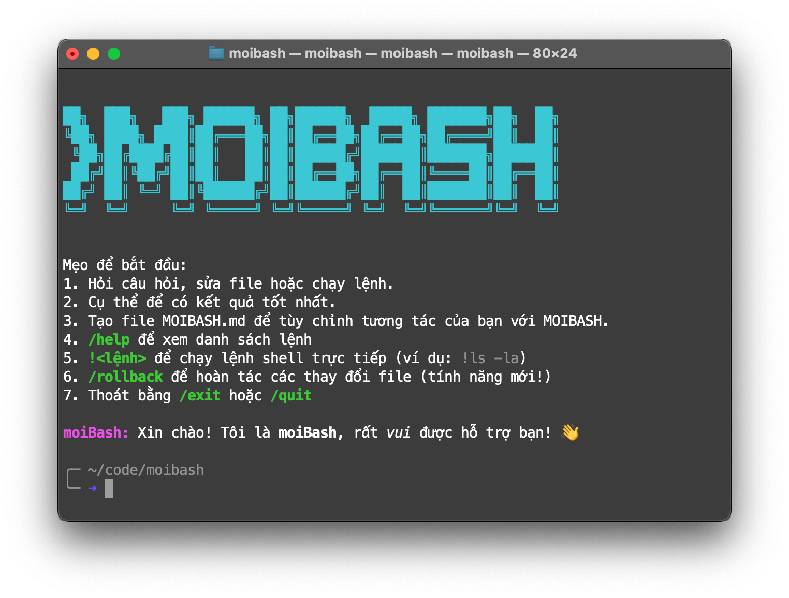

# Moibash - AI Agent đơn giản với thao tác filesystem

[](https://github.com/minhqnd/moibash)
[](https://www.gnu.org/software/bash/)
[](https://ai.google.dev/)



**Moibash** là hệ thống AI filesystem manager thông minh, cho phép quản lý file và thư mục một cách an toàn thông qua giao diện chat tự nhiên. Sử dụng **Gemini Function Calling** để thực hiện các thao tác filesystem với tính năng auto-fix, diff preview, và confirmation system.

## 🚀 Cài đặt nhanh

### ⚡ Cài đặt siêu nhanh (Remote Install)

Chạy một dòng lệnh duy nhất để cài đặt moibash trên bất kỳ máy nào:

```bash
curl -fsSL https://raw.githubusercontent.com/minhqnd/moibash/main/install.sh | bash
```

Script sẽ tự động:
- ✅ Kiểm tra yêu cầu hệ thống (Bash, Python 3.6+, curl, git, pip3)
- ✅ Tải xuống moibash từ GitHub vào `~/.moibash`
- ✅ Tạo symlink để chạy từ bất kỳ đâu
- ✅ Cấu hình quyền thực thi
- ✅ Permissions và cấu hình

Sau khi cài đặt xong, chạy moibash lần đầu:

```bash
moibash
```

**Moibash sẽ tự động hỏi API key ngay lần chạy đầu tiên!** 🎉

**[Cách cài đặt chi tiết](#-chi-tiết-cài-đặt-và-thiết-lập)**

### Cập nhật

Moibash tự động kiểm tra update mỗi ngày. Để update thủ công:

```bash
moibash --update
```

### Gỡ cài đặt

```bash
moibash --uninstall
```

## 🎯 Tổng quan

Moibash là framework bash script tích hợp AI để quản lý filesystem. Hệ thống sử dụng **intent classification** để phân loại yêu cầu và route đến filesystem agent chuyên biệt, kết hợp **Gemini Function Calling** với shell scripts để thực hiện các thao tác file an toàn.

### ✨ Tính năng chính

- 🤖 **Chat thông minh**: Giao diện chat tự nhiên với AI
- 📁 **Filesystem Management**: Đọc, tạo, sửa, xóa file/thư mục an toàn
- 🔄 **Auto-Fix & Test Loop**: Tự động sửa lỗi code và test (max 3 lần)
- 🎨 **Diff Preview**: Xem preview thay đổi trước khi apply
- 🛡️ **Confirmation System**: Xác nhận trước thao tác nguy hiểm
- 🔍 **Advanced Search**: Tìm kiếm file theo pattern, recursive
- 🐚 **Shell Operations**: Thực thi lệnh shell an toàn
- 📊 **Performance Optimized**: Xử lý file lớn theo chunks
- 🔒 **Security First**: Validate paths, prevent traversal attacks

## 📁 Cấu trúc dự án

```
moibash/
├── main.sh                 # Giao diện chat chính
├── router.sh               # Router + Intent classification
├── chat_history_*.txt      # Lịch sử chat (tạm thời)
├── .env                    # Cấu hình API keys
├── docs/                   # Tài liệu
├── images/                 # Thư mục lưu ảnh (nếu có)
└── tools/                  # Các agents
    ├── intent.sh           # Intent classifier
    ├── chat.sh             # Chat agent
    ├── image_create.sh     # Image generation agent
    ├── google_search.sh    # Search agent
    ├── filesystem/         # Filesystem agent (CHÍNH)
    │   ├── function_call.py
    │   ├── backup_manager.py
    │   ├── createfile.sh
    │   ├── deletefile.sh
    │   ├── executefile.sh
    │   ├── listfiles.sh
    │   ├── processtool.sh
    │   ├── readfile.sh
    │   ├── renamefile.sh
    │   ├── searchfiles.sh
    │   ├── shell.sh
    │   ├── updatefile.sh
    ├── calendar/           # Calendar agent
    │   ├── auth.sh
    │   ├── calendar.sh
    │   ├── function_call.sh
    │   └── README.md
    └── weather/            # Weather agent
        ├── function_call.sh
        ├── weather.sh
        └── README.md
```

## 🔄 Flow hoạt động

```
User Input (Tiếng Việt)
    ↓
main.sh (Chat Interface)
    ↓
router.sh (Intent Classification)
    ↓
Intent: filesystem/calendar/weather/image_create/google_search/chat
    ↓
Filesystem Agent (function_call.py)
    ↓
Gemini Function Calling
    ↓
Shell Scripts (.sh files)
    ↓
[Confirmation] (cho operations nguy hiểm)
    ↓
Execute Operation + Auto-Fix Loop
    ↓
Natural Language Response
    ↓
User
```

Mermaid Flow: **[Moibash Flowchart](docs/moibash_flowchart.md)**

### Chi tiết từng bước

1. **User Input**: Người dùng nhập yêu cầu tự nhiên về filesystem
2. **Intent Classification**: `tools/intent.sh` phân loại intent bằng Gemini API
3. **Routing**: `router.sh` route đến filesystem agent
4. **Function Calling**: Agent gọi Gemini với function declarations cho filesystem, đọc kỹ hơn ở **[Gemini Function Calling Flow](docs/gemini_function_calling_flow.md)**
5. **Confirmation**: Hiển thị preview/diff cho operations nguy hiểm
6. **Execution**: Shell scripts thực thi + auto-fix loop nếu cần
7. **Response**: Gemini tạo response tự nhiên với kết quả

## 📁 Filesystem Functions (API chính)

### Core Operations
- `read_file(file_path, start_line?, end_line?)` - Đọc file, hỗ trợ chunk reading
- `create_file(file_path, content)` - Tạo file mới với confirmation
- `update_file(file_path, content, mode)` - Cập nhật file với diff preview
- `delete_file(file_path)` - Xóa file/thư mục với backup
- `rename_file(old_path, new_path)` - Đổi tên/move files

### Advanced Operations
- `list_files(dir_path, pattern?, recursive?)` - Liệt kê files theo pattern
- `search_files(dir_path, pattern, recursive?)` - Tìm kiếm files advanced
- `shell(action, target, args?, working_dir?)` - Thực thi shell commands an toàn

### Smart Features
- **Auto-Fix Loop**: Tự sửa syntax/logic errors (max 3 attempts)
- **Diff Preview**: Git-style diff với màu sắc trước khi apply
- **Test Integration**: Chạy tests sau khi fix code
- **Backup System**: Tự động backup trước destructive operations

## 🛡️ Security & Safety

### Confirmation System
Tất cả operations nguy hiểm đều yêu cầu xác nhận:
- ✅ Create/Update/Delete/Rename files
- ✅ Execute shell commands/scripts
- ✅ Operations trên system paths

**Options:**
- `1`: Allow once (chỉ lần này)
- `2`: Allow always (session này)
- `3`: Cancel

### Path Security
- ✅ Validate absolute paths bắt buộc
- ❌ Block system directories (`/etc`, `/root`)
- ✅ Prevent path traversal (`../../../etc/passwd`)
- ✅ Permission checks trước operations

## 🎨 Diff Preview Feature

### Git-style Diff Display
```
╭─ Diff Preview: config.json
--- a/config.json
+++ b/config.json
@@ -1,3 +1,4 @@
 {
-  "debug": false
+  "debug": true,
+  "new_setting": "value"
 }
╰─────────────────────────────────
```

### Color Coding
- 🔴 **Red**: Deleted lines (`-`)
- 🟢 **Green**: Added lines (`+`)
- ⚪ **Gray**: Context lines
- 🔵 **Cyan**: Hunk headers

## 🔄 Auto-Fix & Test Loop

### Intelligent Bug Fixing
Agent tự động phát hiện và sửa lỗi với test loop:

```
1. Code Analysis → 2. Identify Issues → 3. Generate Fix → 4. Auto Test → 5. Verify → 6. Success/Fail
     ↓                      ↓                      ↓                     ↓                ↓              ↓
   Read file            Syntax/Logic errors     Apply fix           Run tests       Check output    Report result
   Check imports        Security issues         Diff preview        Exit codes      Error analysis  Next iteration
```

### Test Strategies
- **Python**: `py_compile`, `import`, `pytest`, `flake8`
- **JavaScript**: `node --check`, `eslint`, `tsc --noEmit`
- **Shell**: `bash -n`, `shellcheck`
- **Java**: `javac`, `maven/gradle test`

**Max 3 attempts** trước khi báo fail và đề xuất manual fix.

## 💡 Ví dụ sử dụng

### 1. Basic File Operations
```
➜ tạo file hello.py với nội dung print('Hello World')
⚠️  CẦN XÁC NHẬN
====================================
📝 Tạo file: hello.py
   Nội dung: print('Hello World')
====================================
Lựa chọn của bạn: 1
✅ Đã tạo file hello.py thành công!
```

### 2. Advanced Reading
```
➜ đọc file large.py từ dòng 100 đến 150
📖 Đọc file large.py (lines 100-150)...
[content displayed]
```

### 3. Smart Code Fixing
```
➜ sửa lỗi syntax trong utils.py
🔧 Phát hiện lỗi: Missing colon on line 25
🔄 Auto-fix attempt 1/3: Adding colon
✅ Test passed: python -m py_compile utils.py
✅ Đã sửa thành công!
```

### 4. Diff Preview Update
```
➜ cập nhật config.json, thêm setting "debug": true
🎨 Diff Preview:
--- a/config.json
+++ b/config.json
@@ -2,4 +2,5 @@
   "port": 3000,
-  "env": "prod"
+  "env": "dev",
+  "debug": true
 }
Lựa chọn của bạn: 1
✅ Đã cập nhật config.json
```

### 5. Advanced Search
```
➜ tìm tất cả files Python có chứa "class"
🔍 Tìm thấy 5 files:
1. models/user.py
2. services/auth.py
3. utils/helpers.py
4. main.py
5. tests/test_user.py
```

### 6. Safe Shell Operations
```
➜ chạy lệnh git status
⚠️  CẦN XÁC NHẬN
====================================
🐚 Shell Command: git status
====================================
Lựa chọn của bạn: 2
✅ Output:
On branch main
Your branch is up to date with 'origin/main'
```

### 7. Batch Operations
```
➜ xóa tất cả files .tmp trong thư mục current
🔍 Tìm thấy: temp1.tmp, temp2.tmp, temp3.tmp
⚠️  Xóa 3 files? [1/2/3]
Lựa chọn của bạn: 1
✅ Đã xóa thành công 3 files (với backup)
```

### 8. Code Analysis Pipeline
```
➜ phân tích chất lượng code trong project
📊 Code Analysis Report:
- Python files: 12/12 syntax OK
- Test coverage: 85%
- Linting issues: 3 (minor)
- Security scan: Clean
```

## 🚀 Chi tiết cài đặt và thiết lập

### 🔧 Cài đặt cục bộ (Local Install)

Nếu bạn muốn clone repository:

```bash
# Clone repository
git clone https://github.com/minhqnd/moibash.git
cd moibash

# Chạy script cài đặt
./install.sh

# Chạy moibash - sẽ tự động hỏi API key nếu chưa có
moibash
```

Script sẽ tự động kiểm tra và cài đặt tương tự remote install.

### Bước 1: Clone repository
```bash
git clone https://github.com/minhqnd/moibash.git
cd moibash
```

### Bước 2: Cài đặt dependencies

**Python 3** (cho một số agents):
```bash
# Ubuntu/Debian
sudo apt install python3 python3-pip

# macOS
brew install python3
```

**curl** (cho API calls):
```bash
# Ubuntu/Debian
sudo apt install curl

# macOS
brew install curl
```

### Bước 3: Cấu hình API keys

Tạo file `.env`:
```bash
cp .env.example .env
```

Chỉnh sửa `.env`:
```bash
# Gemini API (bắt buộc)
GEMINI_API_KEY='your-gemini-api-key-here'

# Google Calendar (tùy chọn)
GOOGLE_CLIENT_ID='your-client-id'
GOOGLE_CLIENT_SECRET='your-client-secret'
GOOGLE_REDIRECT_URI='urn:ietf:wg:oauth:2.0:oob'

# Các API khác nếu cần
```

Lấy Gemini API key: https://ai.google.dev/

### Bước 4: Cài đặt symlink (Khuyến nghị)

```bash
./install.sh
```

Script sẽ:
- Cấp quyền thực thi cho tất cả scripts
- Tạo symlink `/usr/local/bin/moibash` → `moibash.sh`
- Cho phép gọi `moibash` từ bất kỳ đâu

### Bước 5: Test hệ thống
```bash
# Nếu đã cài symlink
moibash

# Hoặc chạy trực tiếp
./moibash.sh

➜ hello
Agent: Xin chào! Tôi là Chat Agent...
```

## 🛠️ Cách mở rộng Filesystem Tool

### Thêm function mới

1. **Tạo shell script** trong `tools/filesystem/`:
```bash
#!/bin/bash
# newfunction.sh

# Validate input
file_path="$1"

# Execute operation
# ... implementation ...

# Return JSON
echo "{\"success\": true, \"result\": \"...\"}"
```

2. **Cập nhật function_call.py**:
```python
# Add to FUNCTIONS
{
  "name": "new_function",
  "description": "Mô tả function",
  "parameters": {
    "type": "object",
    "properties": {"param": {"type": "string"}},
    "required": ["param"]
  }
}

# Add handler
elif function_name == "new_function":
    result = subprocess.run(["./newfunction.sh", param],
                          capture_output=True, text=True)
```

3. **Test**:
```bash
./tools/filesystem/function_call.py "test new function"
```

## 🔗 Tích hợp

### Sử dụng như library

```bash
# Import functions
source tools/filesystem/filesystem.sh
source tools/weather/weather.sh

# Use directly
create_file "test.txt" "content"
get_weather "Hanoi"
```

### Custom Scripts

```bash
#!/bin/bash
# Custom automation script

./router.sh "tạo file backup.sh"
./router.sh "thêm lịch backup lúc 2h sáng"
./router.sh "tạo ảnh biểu đồ thống kê"
```

## 🔧 Bảo trì & Troubleshooting

### Monitoring
```bash
# Check logs
tail -f chat_history_*.txt

# Test filesystem functions
./tools/filesystem/function_call.py "liệt kê thư mục ."
```

### Common Issues

#### "Permission denied"
```bash
# Check permissions
ls -la file.txt

# Fix permissions
chmod 644 file.txt
```

#### "Path not found"
```bash
# Use absolute paths
read_file("/full/path/to/file.txt")

# Check current directory
pwd
```

#### "API quota exceeded"
```bash
# Check quota
curl "https://generativelanguage.googleapis.com/v1/quota?key=$GEMINI_API_KEY"
```

## 🤝 Contributing

### Development Setup
```bash
# Fork repository
git clone https://github.com/minhqnd/moibash.git
cd moibash

# Create feature branch
git checkout -b feature/new-agent

# Make changes
# ... code ...

# Submit PR
git push origin feature/new-agent
```

### Code Standards
- **Bash**: ShellCheck compliant
- **Python**: PEP 8 style
- **Documentation**: Clear, comprehensive
- **Security**: Input validation, safe operations

## 📄 License

MIT License - Xem file `LICENSE` để biết thêm chi tiết.

## 👥 Tác giả

- **Minh Quang** - [minhqnd](https://github.com/minhqnd)
- **Toàn - Quý - Dũng - Huy** - Cho vài module nhỏ và làm tester
- **AI models**: Gemini, Claude, Chat GPT, Grok 🙏 (love you all)

## 🙏 Acknowledgments

- Google AI for Gemini API
- Open-Meteo for weather data
- Google Calendar Documentation
- Bash documentation and community

---

**Version**: 2.1.0  
**Last Updated**: November 16, 2025  
**Repository**: [https://github.com/minhqnd/moibash](https://github.com/minhqnd/moibash)