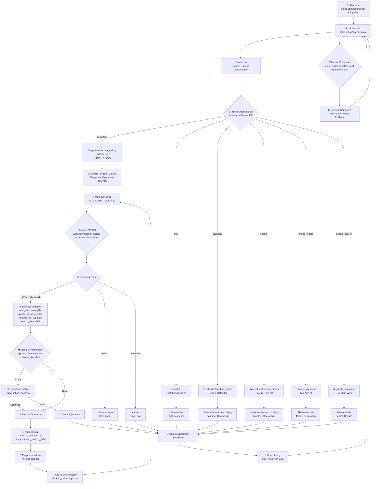

## 📋 Giải thích Flowchart

### 🔄 Luồng chính (Filesystem ưu tiên):
1. **User Input** → Nhập câu hỏi tự nhiên
2. **moibash.sh** → Giao diện chat terminal
3. **router.sh** → Phân loại intent bằng Gemini
4. **Filesystem Tool** → **PRIMARY**: Gemini Function Calling cho file operations
5. **Other Tools** → Chat, Calendar, Weather, Image, Search
6. **Response** → Trả lời tự nhiên

### 🔁 Gemini Function Calling Loop (PRIMARY TOOL - Chi tiết):

#### 🎯 **Multi-turn Conversation Loop**:
- **MAX_ITERATIONS**: 50 function calls tối đa
- **Loop Condition**: `while tool_calls_made < MAX_ITERATIONS`
- **Exit Conditions**:
  - ✅ **TEXT Response**: Gemini trả về câu trả lời cuối cùng
  - ❌ **ERROR**: Lỗi API hoặc parsing
  - ❌ **NO_RESPONSE**: Không có response
  - ❌ **KeyboardInterrupt**: User nhấn Ctrl+C

#### 🤖 **Gemini Function Selection**:
- **Context**: Conversation history + user intent
- **Functions**: 8 functions filesystem (read_file, create_file, update_file, delete_file, rename_file, list_files, search_files, shell)
- **Smart Planning**: Gemini có thể gọi nhiều functions tuần tự để hoàn thành task phức tạp

#### 🛡️ **Confirmation System**:
- **Required for**: update_file, delete_file, rename_file, shell
- **Options**: "1.Yes, 2.Yes always, 3.No"
- **"Yes always"**: SESSION_STATE["always_accept"] = True (không cần confirm nữa)

#### 💾 **Backup System**:
- **Auto Backup**: update_file, delete_file, rename_file
- **Location**: `/tmp/moibash_backup_PID/`
- **Manifest**: JSON tracking tất cả operations
- **Rollback**: Hoàn tác theo thứ tự ngược lại

#### 📊 **Conversation Format**:
```json
[
  {"role": "user", "parts": [{"text": "tạo file test.txt"}]},
  {"role": "model", "parts": [
    {"text": "Đang tạo file..."},
    {"functionCall": {"name": "create_file", "args": {...}}}
  ]},
  {"role": "function", "parts": [{
    "functionResponse": {"name": "create_file", "response": {...}}}
  ]},
  {"role": "model", "parts": [{"text": "Đã tạo file thành công!"}]}
]
```

### 🔧 Special Commands:
- `/rollback` - Hoàn tác tất cả thay đổi file
- `/rollback-status` - Xem trạng thái backup
- `/help` - Hiển thị danh sách lệnh
- `!command` - Chạy lệnh shell trực tiếp
- `/clear` - Xóa màn hình và lịch sử
- `/exit` - Thoát chương trình

### 📁 Cấu trúc dự án:
```
moibash/
├── moibash.sh              # Main interface
├── router.sh               # Router + intent classification
├── intent.sh               # Intent classifier
├── chat_history_*.txt      # Chat history
├── .env                    # API keys
├── moibash_flowchart.md    # This flowchart
├── gemini_function_calling_flow.md  # Detailed function calling guide
├── tools/
│   ├── chat.sh
│   ├── image_create.sh
│   ├── google_search.sh
│   └── filesystem/
│       ├── function_call.py
│       ├── backup_manager.py
│       └── *.sh scripts
└── docs/
```

### 🎯 Intent Types (Filesystem ưu tiên):
- **filesystem**: Quản lý file/folder **PRIMARY TOOL**
- **chat**: Trò chuyện thông thường
- **calendar**: Google Calendar
- **weather**: Tra cứu thời tiết
- **image_create**: Tạo ảnh AI
- **google_search**: Tìm kiếm web

### 💾 Backup System:
- Lưu backup trong `/tmp/moibash_backup_PID/`
- Hỗ trợ rollback tất cả operations
- Manifest tracking cho từng session</content>
<parameter name="filePath">/Users/minhqnd/CODE/moibash/moibash_flowchart.md